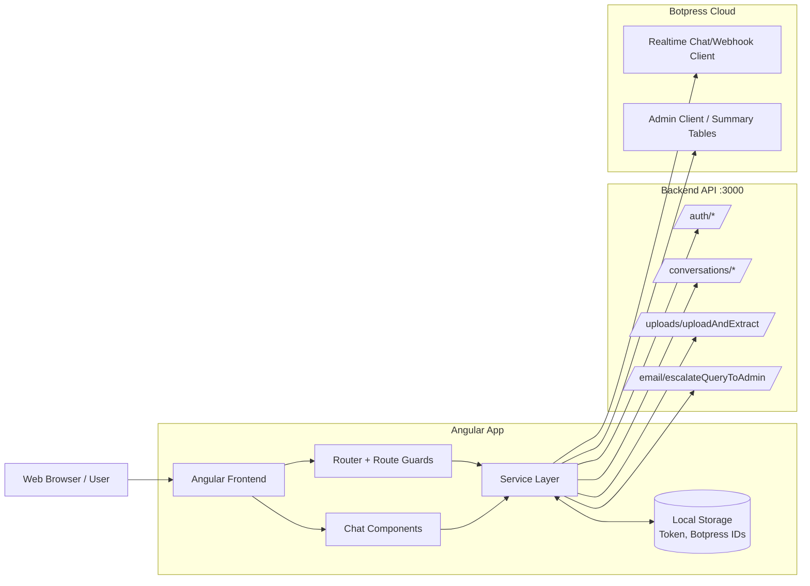

# Planspiel Parenthesis – Frontend

Production-ready frontend documentation for the **Planspiel Parenthesis** web client.

## Table of Contents
- [Overview](#overview)
- [Core Capabilities](#core-capabilities)
- [Architecture](#architecture)
- [Technology Stack](#technology-stack)
- [Repository Structure](#repository-structure)
- [Getting Started](#getting-started)
- [Configuration](#configuration)
- [Available Scripts](#available-scripts)
- [Quality and Testing](#quality-and-testing)
- [License](#license)

## Overview
Planspiel Parenthesis is an Angular 18 frontend for a conversational cybersecurity assistant experience.  
The application provides public onboarding pages, authenticated chat workflows, report/summary views, profile management, and escalation to human support.

This repository contains the **client application** only. It integrates with:
- A backend API (authentication, conversations, uploads, email escalation).
- Botpress Cloud (chat sessions, real-time conversation flows, conversation summaries).

## Core Capabilities
- Authentication flows:
  - Login / signup
  - Forgot password / reset password
  - Route guarding for protected routes
- Chat workspace:
  - Real-time conversation view
  - Conversation sidebar and routing by conversation ID
  - Document upload trigger for extraction flow
- AI operations:
  - Botpress-based messaging and conversation management
  - Summary and user insights screens
- User support:
  - “Talk to a Human” escalation via backend email service
- Profile and supporting screens:
  - User profile page
  - Public landing page, vision page, logout survey, not-found page

## Architecture

### High-Level Diagram


> Source file: `docs/architecture.mmd`

## Technology Stack
- **Framework:** Angular 18
- **Language:** TypeScript
- **Styling/UI:** SCSS, Angular Material, MDB Angular UI Kit
- **Charts:** Chart.js, ng2-charts
- **Chat Integration:** `@botpress/chat`, `@botpress/client`
- **HTTP/Reactive:** Angular HttpClient, RxJS
- **Testing:** Jasmine + Karma

## Repository Structure
```text
src/
  app/
    auth/
      guard/
      interceptor/
    components/
      chatbot/
      profile-page/
    screen/
      public, login, signup, home, vision, auth, logout-survey, ...
    services/
      api/
        authentication/
        botpress/
        conversation/
        email/
        pdf/
  environments/
public/
  assets/
```

## Getting Started

### Prerequisites
- Node.js 18+ (recommended)
- npm 9+ (recommended)

### Installation
```bash
npm install
```

### Run (Development)
```bash
npm start
```
App URL: `http://localhost:4200`

### Build
```bash
npm run build
```

## Configuration
Environment configuration is in:
- `src/environments/environment.ts`
- `src/environments/environment.prod.ts`

Configured integrations:
- `apiURL` → backend base URL
- `botpressApiUrl` + `webhookId` → Botpress connectivity

For production use, keep environment values and credentials in secure configuration pipelines/secrets management.

## Available Scripts
- `npm start` → start Angular dev server
- `npm run build` → production build
- `npm run watch` → development watch build
- `npm test` → unit tests

## Quality and Testing
Run the frontend unit tests:
```bash
npm test
```

Run build verification:
```bash
npm run build
```

## License
This project is licensed under the terms in `LICENSE`.
